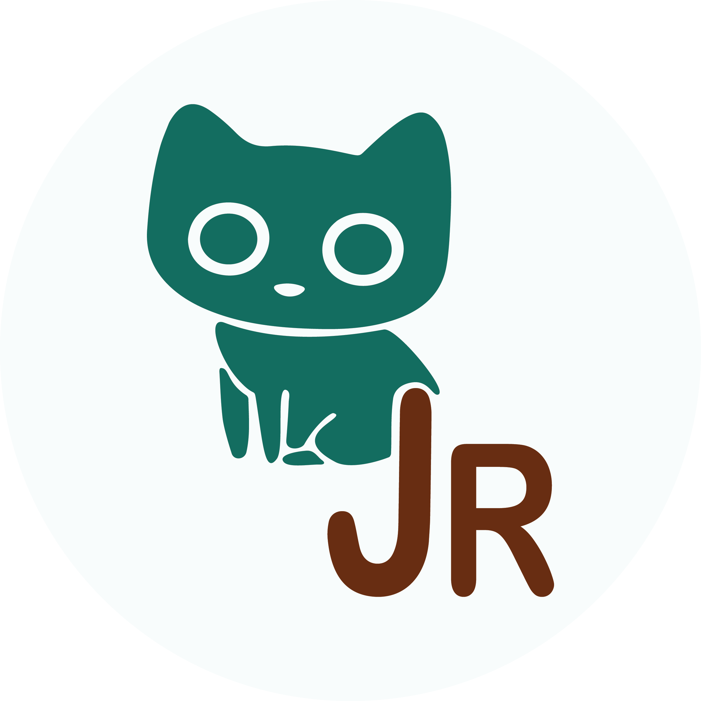

### Hi there!     

Welcome to the repo of my personal website, which was created with [Quarto](https://quarto.org/) and deployed with [Netlify](https://www.netlify.com/).

I hope my website inspires you and this source code helps you create your own dream site.

Please feel free to clone this repository or use code snippets, but please respect the [CC BY-NC-SA license](https://creativecommons.org/licenses/by-nc-sa/4.0/), meaning you can adapt the code with appropriate credit.

As [Silvia Canelón](https://silviacanelon.com/) says, **happy repo-diving!**
